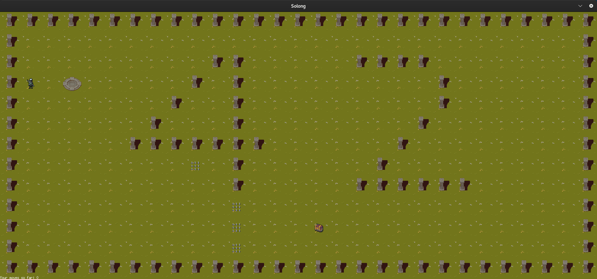

# so_long-42School


A simple 2D graphical game built in C using the MiniLibX library.  
Navigate through a map, collect items, and reach the exit — but watch out for enemies!

## 🕹️ Game Description

- You play a character who must:
  - Collect all the collectibles.
  - Reach the exit.
  - Avoid spikes.
- The map is made of `.ber` files and follows specific formatting rules.
- The game is rendered using the MiniLibX graphics library.

## 🛠️ Compilation

To try the game, run:

```bash
make
./so_long 42_map.ber
